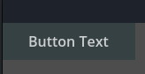
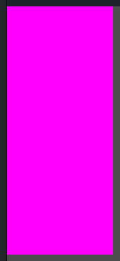

# godot-ui-components
UI components for gamedev mady with Godot

1) [Custom Text button with tween animations](templates/text_button)
1) [Custom Texture button with tween animations](templates/texture_button)

| Images                                                             |
|--------------------------------------------------------------------|
|  |
|  |
